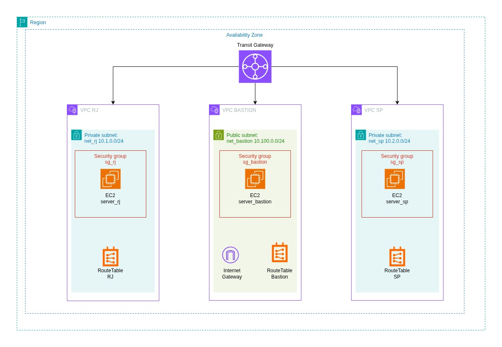
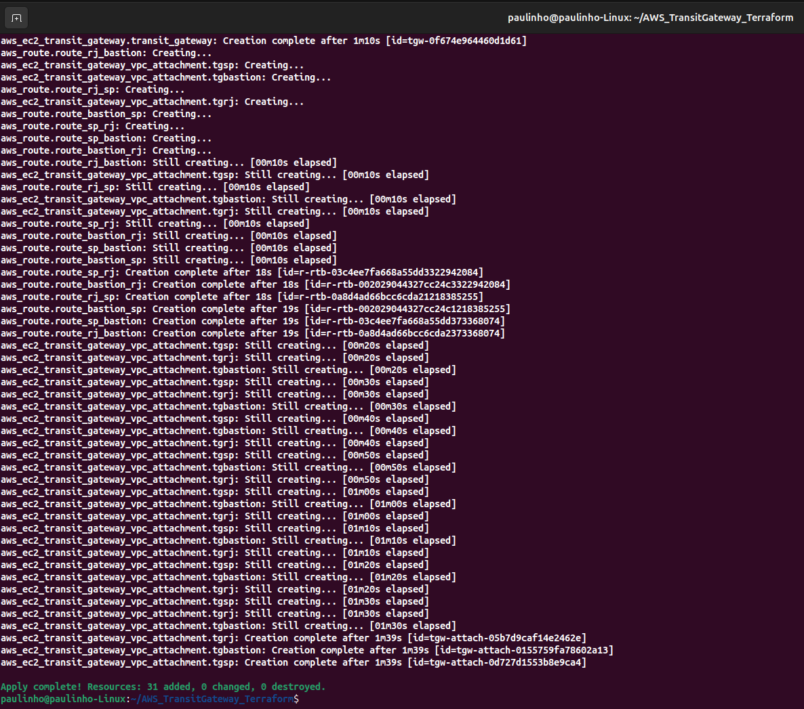
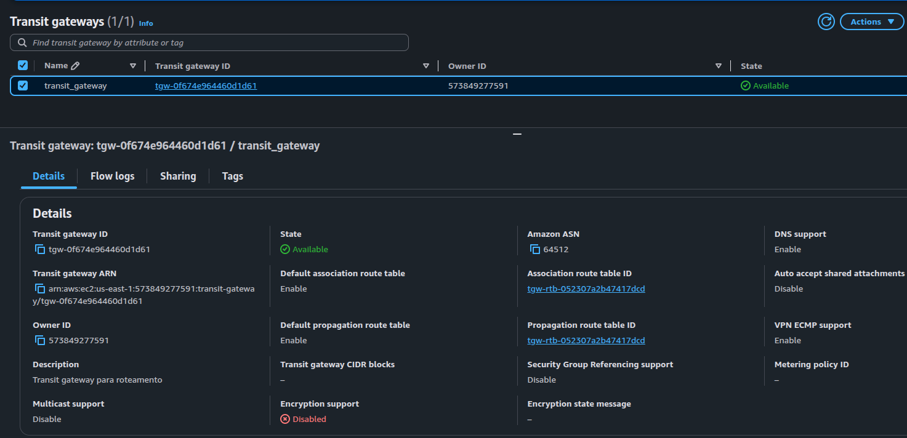
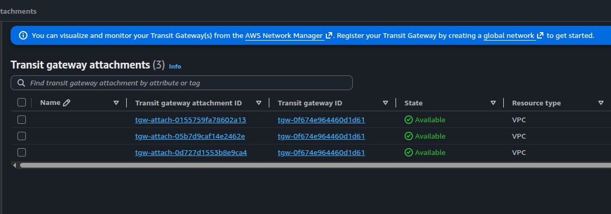
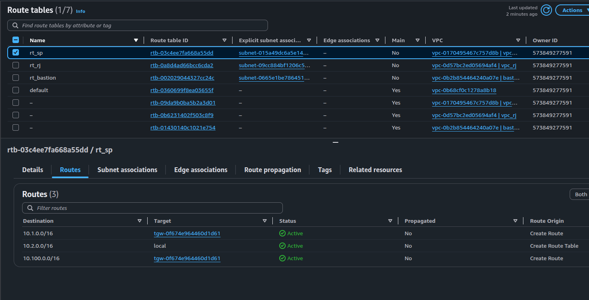
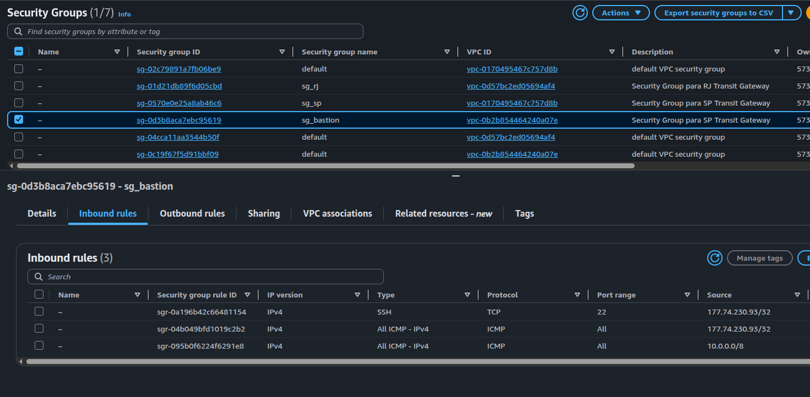
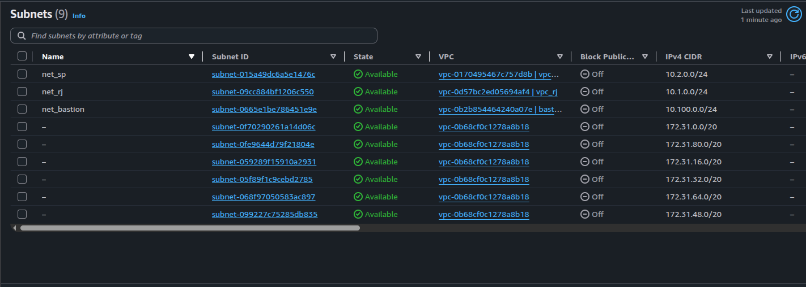
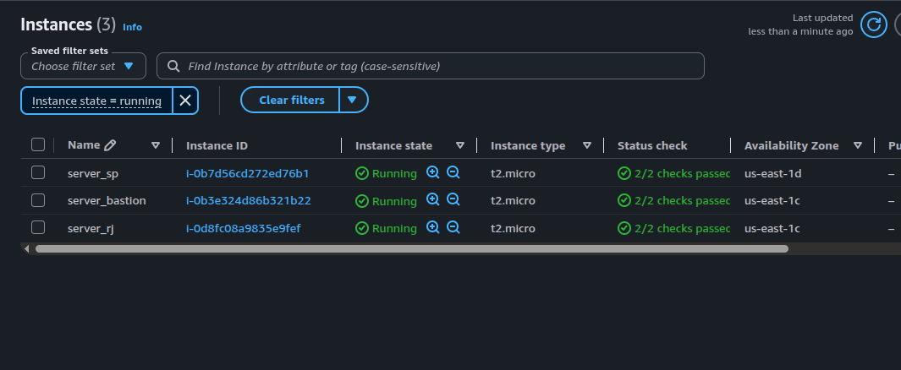
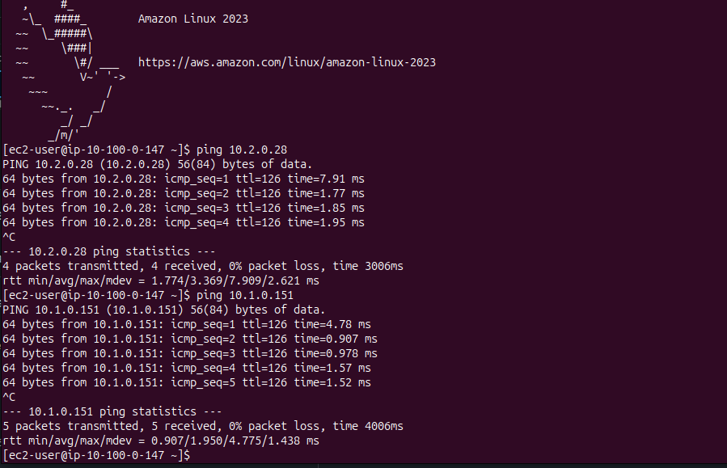
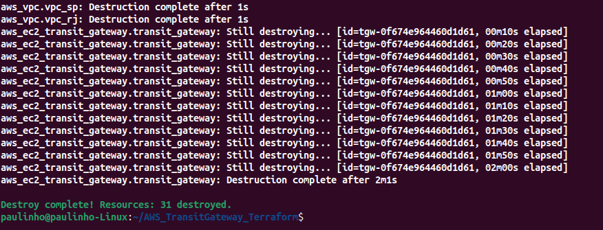

# AWS Transit Gateway com Terraform

## Sobre o projeto

Este laboratório demonstra a criação de uma arquitetura de rede na AWS utilizando **Terraform** para provisionar toda a infraestrutura como código (Infrastructure as Code - IaC).

O objetivo foi implementar a comunicação entre múltiplas VPCs utilizando o **AWS Transit Gateway**, permitindo conectividade privada entre instâncias EC2 localizadas em redes distintas.

Todo o ambiente foi criado automaticamente através do comando `terraform apply`, validado com testes de conectividade e posteriormente removido utilizando `terraform destroy`.

---

## Arquitetura



A infraestrutura é composta por:

- 1 AWS Transit Gateway
- 3 VPCs
  - VPC Bastion
  - VPC RJ
  - VPC SP
- 3 Subnets
- 3 Route Tables
- 3 Security Groups
- 3 Instâncias EC2
- 1 Internet Gateway
- Attachments das VPCs ao Transit Gateway

### Topologia

```
                    AWS Transit Gateway
                           │
        ┌──────────────────┼──────────────────┐
        │                  │                  │
     VPC RJ          VPC BASTION         VPC SP
   10.1.0.0/24      10.10.0.0/24       10.2.0.0/24
        │                  │                  │
    EC2 server_rj    EC2 server_bastion   EC2 server_sp
```

A VPC Bastion possui acesso à Internet através do Internet Gateway e foi utilizada como ponto de administração do ambiente.

As VPCs RJ e SP permanecem privadas e se comunicam através do Transit Gateway.

---

## Tecnologias utilizadas

- AWS
- Terraform
- AWS Transit Gateway
- Amazon VPC
- Amazon EC2
- Internet Gateway
- Route Tables
- Security Groups

---

## Estrutura do projeto

```text
.
├── main.tf
├── compute.tf
├── network.tf
├── routes.tf
├── security_groups.tf
├── README.md
└── images/
```

---

## ⚙ Recursos provisionados

### VPC Bastion

- VPC (vpc_bastion) 10.100.0.0/16
- Subnet Pública (net_bastion) 10.100.0.0/24
- Internet Gateway (igw)
- Route Table (rt_bastion)
- Security Group (sg_bastion)
- EC2 (server_bastion)

### VPC RJ

- VPC (vpc_rj) 10.1.0.0/16
- Subnet Privada (net_rj) 10.1.0.0/24
- Route Table (rt_rj)
- Security Group (sg_rj)
- EC2 (server_rj)

### VPC SP

- VPC (vpc_sp) 10.2.0.0/16
- Subnet Privada (net_sp) 10.2.0.0/24
- Route Table (rt_sp)
- Security Group (sg_sp)
- EC2 (server_sp)

### Conectividade

- AWS Transit Gateway
- Transit Gateway Attachments
- Rotas entre todas as VPCs

---

## ▶ Provisionamento

Inicialização do Terraform:

```bash
terraform init
terraform fmt
```

Visualização do plano de execução:

```bash
terraform plan
terraform validate
```

Criação da infraestrutura:

```bash
terraform apply
```

---

## ✅ Validação do laboratório

Após o provisionamento foram realizados diversos testes para validar o funcionamento da infraestrutura.

### Validações realizadas

- Criação das três VPCs
- Criação das subnets
- Criação das Route Tables
- Criação dos Security Groups
- Criação das instâncias EC2
- Criação do Transit Gateway
- Associação das VPCs ao Transit Gateway
- Configuração das rotas entre as VPCs

---

## Teste de conectividade

Foi realizado acesso SSH à instância **server_bastion**.

A partir dela foram executados testes de conectividade (ping) para as instâncias:

- server_rj
- server_sp

Os testes confirmaram que o roteamento através do AWS Transit Gateway estava funcionando corretamente.

---

## Evidências

Durante o laboratório foram registrados screenshots contendo:

- Recursos provisionados



- Transit Gateway



- VPC Attachments



- Route Tables



- Security groups



- Subnets 



- Instâncias EC2



- Testes de conectividade via ping entre as VPCs




Estas evidências comprovam o correto funcionamento da arquitetura implementada.

---

## Destruição da infraestrutura

Após a validação do ambiente, toda a infraestrutura foi removida utilizando:

```bash
terraform destroy
```

A remoção foi concluída com sucesso, garantindo que nenhum recurso permanecesse ativo na conta AWS, seguindo boas práticas de controle de custos.

-Terraform destroy



---

## Conceitos praticados

- Infrastructure as Code (IaC)
- Terraform
- AWS Transit Gateway
- Amazon VPC
- Subnets Públicas e Privadas
- Internet Gateway
- Route Tables
- Security Groups
- Amazon EC2
- Roteamento entre múltiplas VPCs
- Provisionamento automatizado
- Gerenciamento do ciclo de vida da infraestrutura

---

## Objetivos alcançados

✔ Provisionamento automatizado com Terraform

✔ Comunicação entre múltiplas VPCs utilizando Transit Gateway

✔ Testes de conectividade entre instâncias EC2

✔ Validação da arquitetura implementada

✔ Destruição completa da infraestrutura utilizando Terraform

---

## Autor

**Paulo Ricardo de Souza**

Cloud Engineer Jr | AWS | Terraform | Linux

GitHub:
https://github.com/prsouza91

LinkedIn:
https://www.linkedin.com/in/paulorsouza-infra